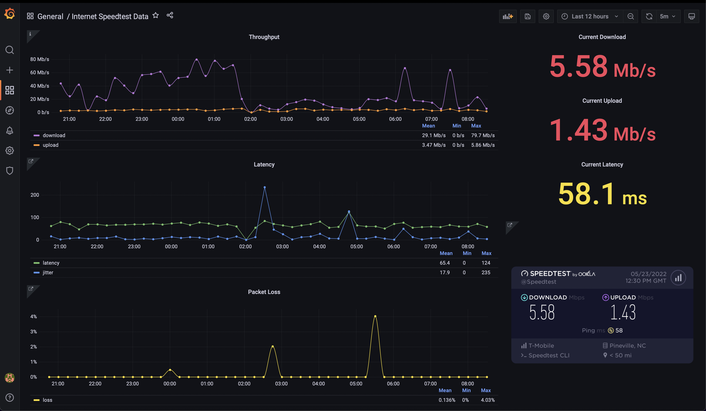

# Speedtestd

This project is a Go wrapper for the Ookla Speedtest CLI that parses the output and sends the data to an InfluxDB server. 



## Quick Start

You can quickly deploy this to kubernetes as a [cronjob](https://kubernetes.io/docs/concepts/workloads/controllers/cron-jobs/) with the included helm chart.

```
helm repo add speedtestd https://jrhorner1.github.io/speedtestd/
helm install my-release speedtestd/speedtestd 
```

Please reference the default [values.yaml](charts/speedtestd/values.yaml) file for configuration options. By default, [grafana](https://github.com/grafana/helm-charts/tree/main/charts/grafana) and [influxdb2](https://github.com/influxdata/helm-charts/tree/master/charts/influxdb2) helm deployments are disabled so be sure to enabled them in the values file along with any of those charts specific options if needed. 
